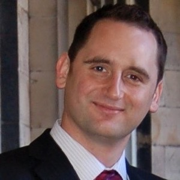
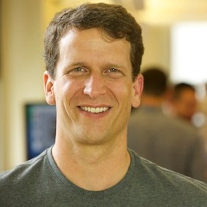
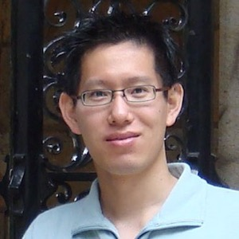
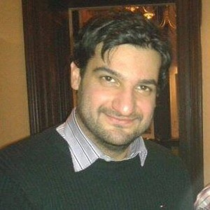
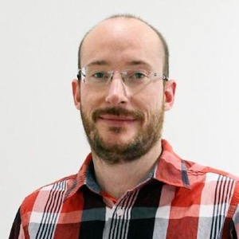

Purpose
==

Lucene is the most widely-used information retrieval toolkit in the world and has emerged as the *de facto* platform used in industry, especially via other software components in the ecosystem such as Solr and Elasticsearch. However, unlike open-source academic information retrieval systems (e.g., Indri, Terrier, etc.), Lucene has been less focused on evaluation, particularly using standard IR test collections. As a result, Lucene is sometimes viewed as less suitable for research. We wish to change this.

This workshop aims to develop Lucene as a platform for information access and retrieval research. We believe that there are numerous benefits for the adoption of Lucene by IR researchers, including greater reproducibility and easier dissemination of research results to the large community of Lucene users. The purpose of this [SIGIR 2017](http://sigir.org/sigir2017/) Workshop is to bring together the community of researchers, practitioners, and developers to realize this vision.

Lucene for Information Access and Retrieval Research (LIARR) is not a traditional "mini conference"-style workshop with a call for papers, submissions reviewed by a program committee, and presentations at the event. Instead, it is designed as a hackathon for attendees to actually work with Lucene in a hands-on capacity. Presentations are meant only as a tool for structuring and guiding the efforts of attendees. Hence, the workshop motto of: ***less yaking, more hacking***.

The goals of this workshop are to:
 - create a development plan and common codebase for IR research with Lucene,
 - implement various information retrieval methods in Lucene/Solr/Elasticsearch,
 - evaluate the quality of such methods and models.

The aim is to take state of the art in the IR field and provide prototype implementations, where we will focus on:

- exposing the standard functions that we need to have access to when we want to code up a retrieval model;
- getting some of the core retrieval functions in there;
- provide an understanding on how some of the functions are implemented in Lucene and how they deviate from how people know them in IR;
- provide a roadmap and set of guidelines to researchers and developers for which models/algorithms/techniques should the community include next into Lucene and how this should be done.

# Format

The workshop is a full day workshop held on the SIGIR workshop day (August 11) and is organised as follows:

 - **Session One (morning):** Introduction talks followed by pitches for ideas for teams to work on (ideas will also be collected through a pre-workshop online discussion). Scheduled introduction talks:
	- [Lucene4IR](https://www.github.com/leifos/lucene4ir) &mdash; Leif Azzopardi will explain the code base of the previous hackathon showing how to run a standard IR batch experiment and evaluate it, and then explain how to hack and mod the toolkit.
	- [Anserini](https://github.com/lintool/Anserini) &mdash; Jimmy Lin will give an overview of Anserini, which provides a range of applications for indexing and retrieval using Lucene.
 - **Session Two (morning):** Break up into teams to work on the different ideas. In parallel other breakout groups will provide training and explaining how the core works and how to mod/hack Lucene for the purpose of running TREC-style research experiments:
	- Lucene and Solr Innards &mdash; Grant Ingersoll, from Lucidworks, will explain the inner loop of Lucene, describing the key innards of Lucene (similarities, codecs, queries) and Solr (components, LTR, parsers) and how they can be extended for research purposes.
	- Elastic4IR &mdash; Guido Zuccon will explain how Elasticsearch can be used for IR experimentation, outlining the point of departure between current retrieval methods in Elasticsearch and how these are instead defined and understood in IR.
 - **Session Three (afternoon):** Starting off with a quick report on progress before teams continue hacking.
 - **Session Four (afternoon):** Finalising and evaluating the methods implemented. Followed by a summary of progress from each of the teams and a plenary to discuss future directions of work and activities.

# Prizes

There will be a series of sponsored Prizes for various awards.

# Organizers

<table>
<tr>
<td width="25%" valign="top"></td>
<td><strong>Leif Azzopardi</strong> is currently a Chancellor’s Research Fellow within the Department of Computer and Information Sciences at the University of Strathclyde in Glasgow, UK. His research interests include: formal models of information seeking and search, and models for information retrieval systems e.g. probabilistic language models, evaluation and developing toolkits for IR research (e.g. PuppyIR, SimIIR, Lucene4IR).</td>
</tr>
<tr>
<td width="25%" valign="top"></td>
<td><strong>Grant Ingersoll</strong> is the CTO and co-founder of Lucidworks, co-author of Taming Text, co-founder of Apache Mahout and a long-standing committer on the Apache Lucene and Solr open source projects. Grant's experience includes engineering a variety of search, question answering, and natural language processing applications for a variety of domains and languages. He earned his B.S. from Amherst College in Math and Computer Science and his M.S. in Computer Science from Syracuse University.</td>
</tr>
<tr>
<td width="25%" valign="top"></td>
<td><strong>Jimmy Lin</strong> is Professor and David R. Cheriton Chair in the David R. Cheriton School of Computer Science at the University of Waterloo. He graduated with a Ph.D. in Electrical Engineering and Computer Science from MIT in 2004. Lin's research aims to build tools that help users make sense of large amounts of data. His work lies at the intersection of information retrieval and natural language processing, with a focus on large-scale distributed algorithms and infrastructure for data analytics.</td>
</tr>
<tr>
<td width="25%" valign="top"></td>
<td><strong>Yashar Moshfeghi</strong> is currently a research associate within the School of Computing Science at the University of Glasgow, UK. His research interests include: game theoretical models for crowdsource-based evaluation as well as relevance feedback techniques for interactive IR using brain, physiological, affective, and interactive signals. He was one of the organisers of the Lucene4IR workshop which aimed to develop Lucene-based toolkits for IR research.</td>
</tr>
<tr>
<td width="25%" valign="top"></td>
<td><strong>Guido Zuccon</strong> is a lecturer within the School of Electrical Engineering and Computer Science at the Queensland University of Technology, Australia. His research interests include formal models of search, ranking principles for IR, and retrieval models for health search. Guido has actively contributed to the area of document ranking and search result diversification, implementing retrieval and ranking methods on top of Open Source search engine platforms, as well as Open Source platforms for capturing relevance assessments.</td>
</tr>
</table>
